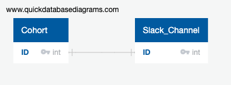
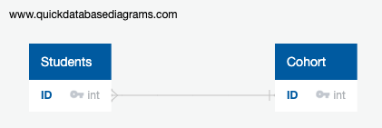
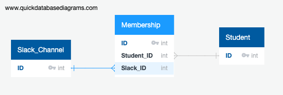

# Databases

## DBMS - Database management system
Structures how you organise and interact with the data in the database

## CRUD - Create, Read, Update, Delete

The four basic operation types on a database

## Relational vs non-relational

### Relational
* data in tables made up of rows and columns
* columns are categories, rows hold individual data entries
* the schema is how the rows, columns and tables are organised, and it must be defined before anything can go in the database
* highly structured with strict data types
* great for managing complex datasets
* use SQL (Structured Query Language) to talk to them

### Non-relational/noSQL
* umbrella term for graph, key-value, document and column family databases
* easier to get up and running quickly as no schema is needed to get started
* good for decentralised, distributed networks (shards and clusters)

Popular DBMS services

* Oracle
* MySQL
* Microsoft SQL
* PostgreSQL
* mongoDB (non-relational)

### SQL

* Strings must be in single quotes
* Use % for wildcards

## SELECT

```SQL
SELECT population FROM world
	WHERE name = 'Germany'
```

```SQL
# show a table with country names and populations for
# the countries in the bracketed list
SELECT name, population FROM world
	WHERE name IN ('Sweden', 'Norway')
```

```SQL
# check for a specific range
SELECT name, area FROM world
  WHERE area BETWEEN 200000 AND 250000
```
Wildcards

```SQL
# select countries starting with Al
SELECT name, population
	FROM world
	WHERE name LIKE "Al%"
	
# select all countries ending in a or l
SELECT name FROM world
 WHERE name LIKE '%a' OR name LIKE '%l'
```
length()

```
# select european countries whose names are 5 characters long
SELECT name,length(name)
FROM world
WHERE length(name)=5 and region='Europe'
```
arithmetic operations

```
# show area x 2
SELECT name, area*2 FROM world WHERE population = 64000
```
XOR

```
SELECT name, population, area FROM world
WHERE population > 250000000 XOR area > 3000000
```

## Entity Relationship Diagrams

Used to describe relationships between entitites within a particular domain.

### 1-to-1 relationships

* One cohort has one slack channel
* One car has one registered owner



### 1-to-many

* One cohort has many students
* One library has many books



### Many-to-many

It is impossible to model many to many relationships with normal database tools. They have to be normalised.

Many students have many slack channels
becomes
One student has many memberships
One slack channel has many memberships



### Exercise - Basic Twitter ERD

